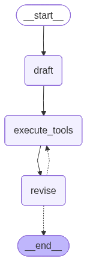

# Reflexion Agent with LangGraph

This project implements a **Reflexion Agent** using [LangGraph](https://github.com/langchain-ai/langgraph). The agent follows a self-correcting research loop to provide high-quality, verified answers to complex questions.



## 🎯 Aim
The goal of this agent is to overcome the limitations of standard LLM responses (like hallucinations or lack of detail) by implementing a "Reflect-Research-Revise" loop. The agent drafts an initial answer, critiques it, searches for missing information using the internet, and then produces a final, cited response.

## 🛠️ Tools & Technologies
- **[LangGraph](https://github.com/langchain-ai/langgraph)**: Orchestrates the circular workflow (Draft -> Search -> Revise).
- **[LangChain](https://github.com/langchain-ai/langchain)**: Provides the framework for prompts, tool binding, and LLM communication.
- **[LangSmith](https://smith.langchain.com/)**: Traces the entire workflow of the agent.
- **[Tavily Search](https://tavily.com/)**: A search engine optimized for LLMs, used to perform real-time research.
- **[Pydantic](https://docs.pydantic.dev/)**: Enforces strict data schemas for AI outputs (ensures we get search queries and critiques in a readable format).
- **[OpenRouter](https://openrouter.ai/)**: Provides access to `gpt-4o-mini` and other state-of-the-art models.
- **Python Dotenv**: Manages sensitive API keys securely.

## 🚀 How it Works
1. **Draft Node**: The AI generates an initial answer based on its internal knowledge. It also critiques itself and creates search queries for things it doesn't know.
2. **Execute Tools Node**: The system takes the generated queries and uses the Tavily API to fetch the latest information from the web.
3. **Revise Node**: The AI takes the original draft, the critique, and the new search results to write a final, improved version with numerical citations.
4. **Loop Control**: The process repeats for a set number of iterations (controlled by `MAX_ITERATIONS` in `main.py`) to ensure maximum accuracy.

## 📦 Project Structure
- `main.py`: Defines the graph structure and runs the application.
- `chains.py`: Contains the LLM logic, prompts, and "actors" (Drafter and Revisor).
- `schemas.py`: Defines the structured data formats (Pydantic models).
- `tool_executor.py`: Handles external API calls for searching the web.

## ⚙️ Setup
1. Clone the repository.
2. Create a `.env` file with your API keys:
   ```env
   OPENAI_API_KEY=your_key_here
   TAVILY_API_KEY=your_key_here
   ```
3. Install dependencies:
   ```bash
   pip install -r requirements.txt
   ```
4. Run the agent:
   ```bash
   python main.py
   ```
